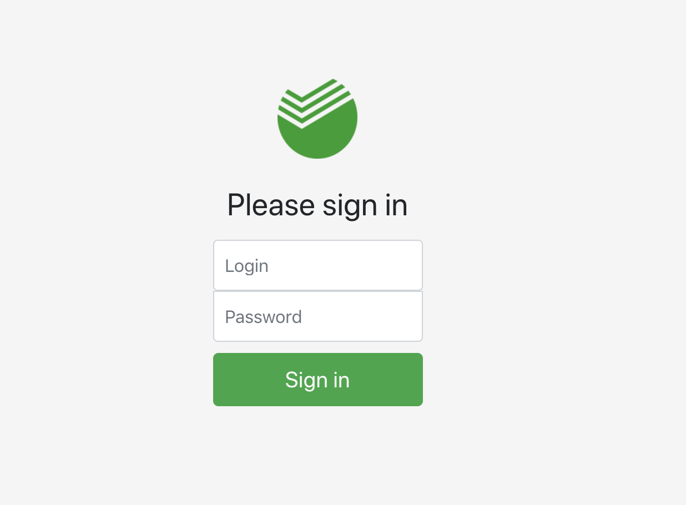

# Моя среда разработки
Я работаю на MacOS Mojave. 
Для корректного запуска сервера нужно: 
mysql: stable 8.0.19 
node: stable 13.11.0 

# Как выполнял работу
Ссылки на статьи, на которые опирался при работе:
#### Create new React-js app : 
https://github.com/facebook/create-react-app#create-react-app--
Быстрый старт + сразу идет установка необходимого софта для сборки. C описания пакета: «Под капотом» используются Babel и webpack.

#### Совмещение стилей
Как использовать ES6 в node js https://www.freecodecamp.org/news/how-to-enable-es6-and-beyond-syntax-with-node-and-express-68d3e11fe1ab/

Было неудобно писать на node js, без такой вещи удобной как import. Для этого установил __esm__ пакет:

npm i esm --save

#### Поднятие сразу 3 серверов 
Сервер для приложения React: npm run start. Запускается на localhost:3000

Node Js сервер: npm run server. Запускается на localhost:3001

mysql сервер: npm run mysqlserv. Запускается на localhost:3006

Пришлось чуть поразбираться, как сделать это паралелльно. Особенно с mysql. О самом сервер чуть позже.

Статья в помощь https://www.twilio.com/blog/react-app-with-node-js-server-proxy

Сервера React и Node Js на прокси соединение.

# База данных
Выбрал mysql так как максимально распространена среди разработки.

В папке DB_base хранится база данных, которую я сам создал для приложения. В бд 2 таблицы: пользователи и диаграммы.
###  Быстрый импорт
Чтобы быстро устоновить мою бд пропишите: mysql -u root -p myexample < myexample.sql

Так как теперь подключаться по __root__ к базе нельзя, пришлось создать пользователя для подключения:

>sudo mysql -u root -p (спросит пароль) 
create user 'test_user'@'%' identified by 'test_user'; 
grant all privileges on *.* to 'test_user'@'%'; 
grant grant option on *.* to 'test_user'@'%'; 
flush privileges; 
quit; 
>

В файле server/config/config.js Лежит структура, в которой прописанно настройки подключения.  
Для работы с Mysql использую npm i mysql2.  

>Таблицы tbl_user 

user_id | user_login | user_password
---: | :-- | :-- 
|       1 | admin | admin

>Описание таблицы с диаграммами

Field| Type| Null | Key | Default | Extra |
---| ---| ---| ---| ---| ---
diagram_name | varchar(45) | NO   |     | NULL    |      
diagram_text | longtext    | NO   |     | NULL    |      

diagram_name - название диаграммы. 
diagram_text - тело XML диаграммы в виде строки.

# Быстрый запуск
После того, как все необходимые пакеты установлены, база данных готова, прописываем: __npm run dev__ 
Происходит параллельный запуск 3 серверов.

## Приветсвенное окно (окно авторизации)
Сделал окно авторизации. При вводе происходит проверка на наличие пользователя в бд. Сделал только -u admin -p admin. 
Пароль не стал шифровать, но вообще знаю как это сделать через sha256 шифрование.

### Бонусом сделал cookie, чтобы при обновлении страницы не логиняться

# Основное окно
Использовал react-bpmn пакет для React-js. В целом разобрался, мог бы позже подключить полный bpmn для редактирования моделей.

## Доп бонусы
Сделал выбор из бд 3 загруженных примеров XML диаграмм + возможность загрузить с компа в приложение, а потом сохранить на сервер.

##### И на последок
Попробовал сделать окно авторизации в стиле Сбербанка. 
